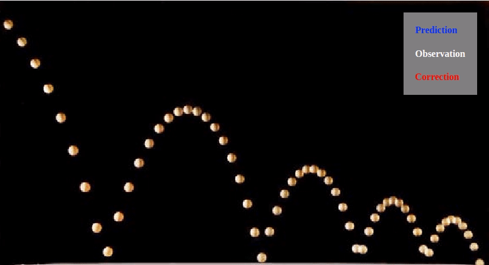
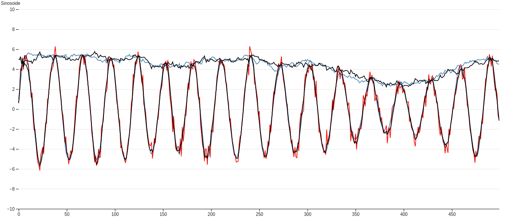
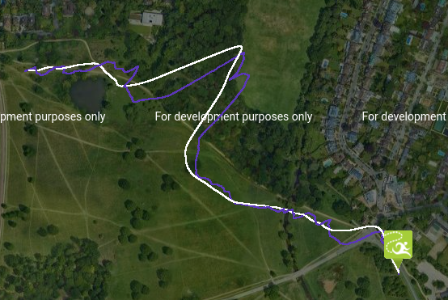
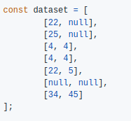
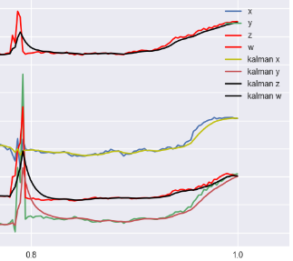
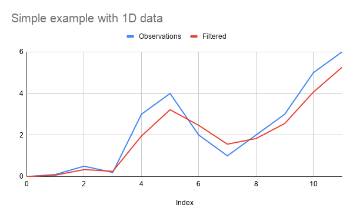

# kalman-filter

[Kalman Filter](https://en.wikipedia.org/wiki/Kalman_filter) in JavaScript (for both node.js and the browser)

This library implements following features:
* N-dimensional Kalman Filter (for [multivariate Gaussian](https://en.wikipedia.org/wiki/Multivariate_normal_distribution))
* Forward Kalman Filter (Online)
* Forward-Backward Smoothing Kalman Filter
* Split Prediction/Correction steps
* Extended Kalman Filter
* Correlation Matrix

## Demos/Examples

|Link | Description | Image |
|---|---|---|
| [Bikes](http://piercus.github.io/kalman-filter) | 4D Constant Acceleration boxes |  |
| [Bouncing Ball](http://piercus.github.io/kalman-filter/bouncing-ball.html) | 2D constant acceleration with bounces |  |
| [Sinusoidale Extended Kalman-Filter](https://observablehq.com/d/a033acc0859cc0de) | 1D Extended KF Sinus |  |
| [Code pen GPS Data smoothing with constant speed](https://codepen.io/piercus/pen/wvoqPww) | 2D constant speed |  |
| [Partial Observation](https://github.com/piercus/kalman-filter/issues/34) | 1D / 2 sensor with missing values |  |
| [Smooth 3x3 rotation matrix](https://github.com/piercus/kalman-filter/issues/37) | 4d smoothing |  |

[Open an issue](https://github.com/piercus/kalman-filter/issues/new) to add more examples in this section explaining how you use this library !

## Installation

### Npm


```sh
npm install kalman-filter
```

```js
const {KalmanFilter} = require('kalman-filter');
```

### Browser usage

Download the file `kalman-filter.min.js` from [Releases page](https://github.com/piercus/kalman-filter/releases)

Add it to your project like :

```html
<script src="dist/kalman-filter.min.js"></script>
<script>
var {KalmanFilter} = kalmanFilter;

// ... do whatever you want with KalmanFilter

</script>
```


## Simple Example

### 1D Smoothing Usage

```js
const {KalmanFilter} = require('kalman-filter');

const observations = [0, 0.1, 0.5, 0.2, 3, 4, 2, 1, 2, 3, 5, 6];
// this is creating a smoothing
const kFilter = new KalmanFilter();
const res = kFilter.filterAll(observations)
// res is a list of list (for multidimensional filters)
// [
//   [ 0 ],
//   [ 0.06666665555510715 ],
//   [ 0.3374999890620582 ],
//   [ 0.25238094852592136 ],
//   [ 1.9509090885288296 ],
//   [ 3.2173611101031616 ],
//   [ 2.4649867370240965 ],
//   [ 1.5595744679428254 ],
//   [ 1.831772445766021 ],
//   [ 2.5537767922925685 ],
//   [ 4.065625882212133 ],
//   [ 5.26113483436549 ]
// ]
```
Result is :



### 2D Smoothing Usage

```js
const {KalmanFilter} = require('kalman-filter');

const observations = [[0, 1], [0.1, 0.5], [0.2, 3], [4, 2], [1, 2]];
const kFilter = new KalmanFilter({observation: 2});
// equivalent to
// new KalmanFilter({
// 	observation: {
// 		name: 'sensor',
// 		sensorDimension: 2
// 	}
// });
const res = kFilter.filterAll(observations)
```

### 2D Smoothing with constant-speed model

```js
const {KalmanFilter} = require('kalman-filter');

const observations = [[0, 1], [0.1, 0.5], [0.2, 3], [4, 2], [1, 2]];
const kFilter = new KalmanFilter({
	observation: 2,
	dynamic: 'constant-speed'
});
// equivalent to
// new KalmanFilter({
// 	observation: {
// 		name: 'sensor',
// 		sensorDimension: 2
// 	},
// 	dynamic: {
// 		name: 'constant-speed'
// 	},
// });
const res = kFilter.filterAll(observations)
```

## How to instantiate your kalman filter

### Advanced usage

This library gives you the ability to fully configure your kalman-filter.

For advanced usage, here is the correspondance table with the matrix name of the [wikipedia article](https://en.wikipedia.org/wiki/Kalman_filter#Underlying_dynamical_system_model)

| Wikipedia article | kalman-filter js lib |
|--|--|
| $F_k$, the state-transition model | `dynamic.transition` |
| $H_k$, the observation model | `observation.stateProjection` |
| $Q_k$, the covariance of the process noise | `dynamic.covariance` |
| $R_k$, the covariance of the observation noise | `observation.covariance` |
| $B_k u_k$, the control-input model multiplied by the control vector | `dynamic.constant` |
|$\mathbf{P}_{0\mid 0}$| `dynamic.init.covariance` |
|$\mathbf{x}_{0\mid 0}$| `dynamic.init.mean` |

### Configure the dynamic with `dynamic.name`


`dynamic.name` is a shortcut to give you access to preconfigured dynamic models, you can also register your own shortcust see [Register models shortcuts](#register-models-shortcuts)

Available default models as :
* constant-position
* constant-speed
* constant-acceleration

This will automatically configure the `dynamic.transition` matrix.

##### constant-position

```math
\begin{align}
State :& \begin{bmatrix} x_t \end{bmatrix}\\ 
Transition Equation :& x_t \sim x_{t-1} \\ 
dynamic.transition :& \begin{bmatrix} 1 \end{bmatrix}
\end{align}
```

##### constant-speed

```math
\begin{align}
State :& \begin{bmatrix} x_t \\ speed_t \end{bmatrix} \\ 
Transition Equation :& 
\begin{split}
x_t &\sim x_{t-1} + speed_{t-1},\\ 
speed_t &\sim speed_{t-1}
\end{split} \\ 
dynamic.transition :& \begin{bmatrix} 1 & 1 \\ 0 & 1 \end{bmatrix}
\end{align}
```

##### constant-acceleration

```math
\begin{align}
State :& \begin{bmatrix} x_t \\ speed_t \\ acc_t \end{bmatrix} \\ 

Transition Equation :& 
\begin{split}
x_t &\sim x_{t-1} + speed_{t-1} \\ 
speed_t &\sim speed_{t-1} + acc_{t-1} \\ 
acc_t &\sim acc_{t-1}
\end{split} \\ 
dynamic.transition :& \begin{bmatrix} 1 & 1 & 0 \\ 0 & 1 & 1 \\ 0 & 0 & 1\end{bmatrix}
\end{align}
```

#### 'constant-position' on 2D data

This is the default behavior

```js
const {KalmanFilter} = require('kalman-filter');

const kFilter = new KalmanFilter({
	observation: {
		sensorDimension: 2,
		name: 'sensor'
	},
	dynamic: {
		name: 'constant-position',// observation.sensorDimension == dynamic.dimension
		covariance: [3, 4]// equivalent to diag([3, 4])
	}
});

```

#### 'constant-speed' on 3D data


```js
const {KalmanFilter} = require('kalman-filter');

const kFilter = new KalmanFilter({
	observation: {
		sensorDimension: 3,
		name: 'sensor'
	},
	dynamic: {
		name: 'constant-speed',// observation.sensorDimension * 2 == state.dimension
		timeStep: 0.1,
		covariance: [3, 3, 3, 4, 4, 4]// equivalent to diag([3, 3, 3, 4, 4, 4])
	}
});

```

#### 'constant-acceleration' on 2D data


```js
const {KalmanFilter} = require('kalman-filter');

const kFilter = new KalmanFilter({
	observation: {
		sensorDimension: 2,
		name: 'sensor'
	},
	dynamic: {
		name: 'constant-acceleration',// observation.sensorDimension * 3 == state.dimension
		timeStep: 0.1,
		covariance: [3, 3, 4, 4, 5, 5]// equivalent to diag([3, 3, 4, 4, 5, 5])
	}
});

```

### Instanciation of a generic linear model

This is an example of how to build a constant speed model, in 3D without `dynamic.name`, using detailed api.

* `dynamic.dimension` is the size of the state
* `dynamic.transition` is the state transition model that defines the dynamic of the system
* `dynamic.covariance` is the covariance matrix of the transition model
* `dynamic.init` is used for initial state (we generally set a big covariance on it)

```js
const {KalmanFilter} = require('kalman-filter');

const timeStep = 0.1;

const huge = 1e8;

const kFilter = new KalmanFilter({
	observation: {
		dimension: 3
	},
	dynamic: {
		init: {
			// We just use random-guessed values here that seems reasonable
			mean: [[500], [500], [500], [0], [0], [0]],
			// We init the dynamic model with a huge covariance cause we don't
			// have any idea where my modeled object before the first observation is located
			covariance: [
				[huge, 0, 0, 0, 0, 0],
				[0, huge, 0, 0, 0, 0],
				[0, 0, huge, 0, 0, 0],
				[0, 0, 0, huge, 0, 0],
				[0, 0, 0, 0, huge, 0],
				[0, 0, 0, 0, 0, huge],
			],
		},
		// Corresponds to (x, y, z, vx, vy, vz)
		dimension: 6,
		// This is a constant-speed model on 3D : [ [Id , timeStep*Id], [0, Id]]
		transition: [
			[1, 0, 0, timeStep, 0, 0],
			[0, 1, 0, 0, timeStep, 0],
			[0, 0, 1, 0, 0, timeStep],
			[0, 0, 0, 1, 0, 0],
			[0, 0, 0, 0, 1, 0],
			[0, 0, 0, 0, 0, 1]
		],
		// Diagonal covariance for independant variables
		// since timeStep = 0.1,
		// it makes sense to consider speed variance to be ~ timeStep^2 * positionVariance
		covariance: [1, 1, 1, 0.01, 0.01, 0.01]// equivalent to diag([1, 1, 1, 0.01, 0.01, 0.01])
	}
});

```

### Configure the observation

#### Using `sensor` observation

The observation is made from 2 different sensors with identical properties (i.e. same covariances) , the input measure will be `[<sensor0-dim0>, <sensor0-dim1>, <sensor1-dim0>, <sensor1-dim1>]`.

```js
const {KalmanFilter} = require('kalman-filter');

const timeStep = 0.1;

const kFilter = new KalmanFilter({
	observation: {
		sensorDimension: 2,// observation.dimension == observation.sensorDimension * observation.nSensors
		nSensors: 2,
		sensorCovariance: [3, 4], // equivalent to diag([3, 4])
		name: 'sensor'
	},
	dynamic: {
		name: 'constant-speed',// observation.sensorDimension * 2 == state.dimension
		covariance: [3, 3, 4, 4]// equivalent to diag([3, 3, 4, 4])
	}
});

```

#### Custom Observation matrix

The observation is made from 2 different sensors with different properties (i.e. different covariances), the input measure will be `[<sensor0-dim0>, <sensor0-dim1>, <sensor1-dim0>, <sensor1-dim1>]`.

This can be achived manually by using the detailed API :
* `observation.dimension` is the size of the observation
* `observation.stateProjection` is the matrix that transforms state into observation, also called *observation model*
* `observation.covariance` is the covariance matrix of the *observation model*

```js
const {KalmanFilter} = require('kalman-filter');

const timeStep = 0.1;

const kFilter = new KalmanFilter({
	observation: {
		dimension: 4,
		stateProjection: [
			[1, 0, 0, 0],
			[0, 1, 0, 0],
			[1, 0, 0, 0],
			[0, 1, 0, 0]
		],
		covariance: [3, 4, 0.3, 0.4]
	},
	dynamic: {
		name: 'constant-speed',// observation.sensorDimension * 2 == state.dimension
		covariance: [3, 3, 4, 4]// equivalent to diag([3, 3, 4, 4])
	}
});
```

## Play with Kalman Filter

In order to use the Kalman-Filter with a dynamic or observation model which is not strictly a [General linear model](https://en.wikipedia.org/wiki/General_linear_model), it is possible to use `function` in following parameters :
* `observation.stateProjection`
* `observation.covariance`
* `dynamic.transition`
* `dynamic.covariance`
* `dynamic.constant`

In this situation this `function` will return the value of the matrix at each step of the kalman-filter.

In this example, we create a constant-speed filter with non-uniform intervals;

```js
const {KalmanFilter} = require('kalman-filter');

const intervals = [1,1,1,1,2,1,1,1];

const kFilter = new KalmanFilter({
	observation: {
		dimension: 2,
		/**
		* @param {State} opts.predicted
		* @param {Array.<Number>} opts.observation
		* @param {Number} opts.index
		*/
		stateProjection: function(opts){
			return [
				[1, 0, 0, 0],
				[0, 1, 0, 0]
			]
		},
		/**
		* @param {State} opts.predicted
		* @param {Array.<Number>} opts.observation
		* @param {Number} opts.index
		*/		
		covariance: function(opts){
			return [
				[1, 0, 0, 0],
				[0, 1, 0, 0],
				[0, 0, 1, 0],
				[0, 0, 0, 1]
			]
		}
	},
	dynamic: {
		dimension: 4, //(x, y, vx, vy)
		/**
		* @param {State} opts.previousCorrected
		* @param {Number} opts.index
		*/
		transition: function(opts){
			const dT = intervals[opts.index];
			if(typeof(dT) !== 'number' || isNaN(dT) || dT <= 0){
				throw(new Error('dT should be positive number'))
			}
			return [
				[1, 0, dT, 0],
				[0, 1, 0, dT]
				[0, 0, 1, 0]
				[0, 0, 0, 1]
			]
		},
		/**
		* @param {State} opts.previousCorrected
		* @param {Number} opts.index
		*/		
		covariance: function(opts){
			const dT = intervals[opts.index];
			if(typeof(dT) !== 'number' || isNaN(dT) || dT <= 0){
				throw(new Error('dT should be positive number'))
			}			
			return [
				[1, 0, 0, 0],
				[0, 1, 0, 0],
				[0, 0, 1*dT, 0],
				[0, 0, 0, 1*dT]
			]
		}
	}
});
```
### Extended

If you want to implement an [extended kalman filter](https://en.wikipedia.org/wiki/Extended_Kalman_filter)

You will need to put your non-linear functions in the following parameters

* `observation.fn`
* `dynamic.fn`

See an example in [Sinusoidale Extended Kalman-Filter](https://observablehq.com/d/a033acc0859cc0de)

### Using Control model

If you want to add a constant parameter in the dynamic model (also called `control input`), you can use `dynamic.constant` function

See an example code in `demo/bouncing-ball` or the result in [Bouncing Ball example](https://observablehq.com/d/a033acc0859cc0de)


## Use your kalman filter

### Simple Batch usage (run it once for the whole dataset)

```js
const observations = [[0, 2], [0.1, 4], [0.5, 9], [0.2, 12]];

// batch kalman filter
const results = kFilter.filterAll(observations);
```
### Online filter

When using online usage (only the forward step), the output of the `filter` method is an instance of the ["State"](/lib/state.js) class.

```js
// online kalman filter
let previousCorrected = null;
const results = [];
observations.forEach(observation => {
	previousCorrected = kFilter.filter({previousCorrected, observation});
	results.push(previousCorrected.mean);
});
```

### Predict/Correct detailed usage (run it online)

If you want to use KalmanFilter in more advanced usage, you might want to dissociate the `predict` and the `correct` functions

```js
// online kalman filter
let previousCorrected = null;
const results = [];
observations.forEach(observation => {
	const predicted = kFilter.predict({
		previousCorrected
	});

	 const correctedState = kFilter.correct({
		predicted,
		observation
	});

	results.push(correctedState.mean);

	// update the previousCorrected for next loop iteration
	previousCorrected = correctedState
});

console.log(results);
```

### Batch Forward - Backward smoothing usage

The Forward - Backward process

```js
// batch kalman filter
const results = kFilter.filterAll({observations, passMode: 'forward-backward'});
```

## Register models shortcuts

To get more information on how to build a dynamic model, check in the code `lib/dynamic/` (or `lib/observation` for observation models).

If you feel your model can be used by other, do not hesitate to create a Pull Request.

```js
const {registerDynamic, KalmanFilter, registerObservation} = require('kalman-filter');

registerObservation('custom-sensor', function(opts1){
	// do your stuff
	return {
		dimension,
		stateProjection,
		covariance
	}
})

registerDynamic('custom-dynamic', function(opts2, observation){
	// do your stuff
	// here you can use the parameter of observation (like observation.dimension)
	// to build the parameters for dynamic
	return {
		dimension,
		transition,
		covariance
	}
})

const kFilter = new KalmanFilter({
	observation: {
		name: 'custom-sensor',
		// ... fields of opts1
	},
	dynamic: {
		name: 'custom-dynamic',
		// ... fields of opts2
	}
});

```

## Set your model parameters from the ground truths state values

In order to find the proper values for covariance matrix, we use following approach :

```js

const {getCovariance, KalmanFilter} = require('kalman-filter');

// Ground truth values in the dynamic model hidden state
const groundTruthStates = [ // here this is (x, vx)
	[[0, 1.1], [1.1, 1], [2.1, 0.9], [3, 1], [4, 1.2]], // example 1
	[[8, 1.1], [9.1, 1], [10.1, 0.9], [11, 1], [12, 1.2]] // example 2
]

// Observations of this values
const measures = [ // here this is x only
	[[0.1], [1.3], [2.4], [2.6], [3.8]], // example 1
	[[8.1], [9.3], [10.4], [10.6], [11.8]] // example 2
];

const kFilter = new KalmanFilter({
	observation: {
		name: 'sensor',
		sensorDimension: 1
	},
	dynamic: {
		name: 'constant-speed'
	}
})

const dynamicCovariance = getCovariance({
	measures: groundTruthStates.map(ex =>
		return ex.slice(1)
	).reduce((a,b) => a.concat(b)),
	averages: groundTruthStates.map(ex =>
		return ex.slice(1).map((_, index) => {
			return kFilter.predict({previousCorrected: ex[index - 1]}).mean;
		})
	).reduce((a,b) => a.concat(b))
});

const observationCovariance = getCovariance({
	measures: measures.reduce((a,b) => a.concat(b)),
	averages: groundTruthStates.map((a) => a[0]).reduce((a,b) => a.concat(b))
});

```

## How to measure how good does a specific model fits with data

There are different ways to measure the performance of a model against some measures :

### Model fits with a specific measurements

We use [Mahalanobis distance](https://en.wikipedia.org/wiki/Mahalanobis_distance)

```js
const observations = [[0, 2], [0.1, 4], [0.5, 9], [0.2, 12]];

// online kalman filter
let previousCorrected = null;
const results = [];

observations.forEach(observation => {
	const predicted = kFilter.predict({
		previousCorrected
	});

	const dist = predicted.mahalanobis(observation)

	previousCorrected = kFilter.correct({
		predicted,
		observation
	});

	distances.push(dist);
});

const distance = distances.reduce((d1, d2) => d1 + d2, 0);
```
### How precise is this Model

We compare the model with random generated numbers sequence.

```js
const h = require('hasard')
const observationHasard = h.array({value: h.number({type: 'normal'}), size: 2})

const observations = observationHasard.run(200);

// online kalman filter
let previousCorrected = null;
const results = [];

observations.forEach(observation => {
	const predicted = kFilter.predict({
		previousCorrected
	});

	const dist = predicted.mahalanobis(measure)

	previousCorrected = kFilter.correct({
		predicted,
		observation
	});

	distances.push(dist);
});

const distance = distances.reduce((d1, d2) => d1 + d2, 0);

```

### Credits

Thanks to _Adrien Pellissier_ for his hard work on this library.

### Similar Project

For a simple 1D Kalman filter in javascript see https://github.com/wouterbulten/kalmanjs
